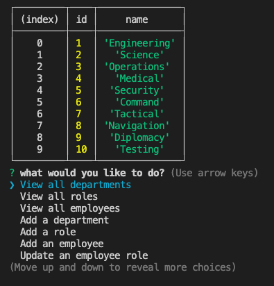
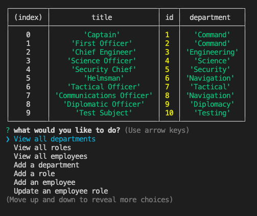
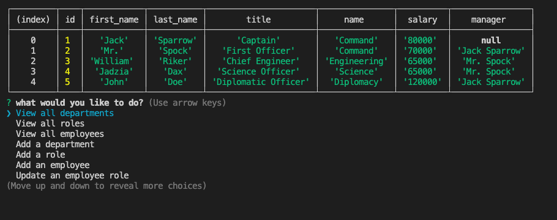

# Employee Tracker

A command-line application that manages a company (or starship's) employee database.

## Description

- This data-management tool enables the user to quickly navigate through tables describing job titles, employee names, salaries, and departments without the need for spreadsheets. Data can be added, deleted or modified based on command-line prompts. .
- When dealing with complex hiring structures or constant turnover, this application will server the user well by simplifying the task of updating the employee database with just a few clicks.
- This project will enable the user to maintain an organized database of all employees and their roles within the company, while giving them control over the task of updating this information quickly from the command-line. In short, it will save time and keep things organized..
- In developing this project, the devs learned the importance of keeping a well-structured SQL database. Keeping data structured and well-connected means the user will have a much easier time of updating and manipulating this data later on..

## Table Of Contents

[Installation](#installation)
[Usage](#usage)
[Credits](#credits)
[License](#license)

## Installation

- First, be sure to open the .sql files in your command line.
- Run 'mysql' (or 'mysql -u root' if there is no password, or 'mysql -u root -p' if you have a password enabled).
- Next, run 'SOURCE schema.sql;' to import the database structure, then run 'SOURCE seeds.sql;' to import the seed data provided by the developer.
- Please note, that the source.sql file includes a command to DROP DATABASE IF EXISTS books_db; which will clear any previous instances of the hr_db database. Be sure to remove this line if you want to perpetuate this database.
- Next, exit mysql and open the server.js file in the command line. run 'npm i' to install all dependencies and then
- Run 'npm start' to initate the program.

## Usage

- Once the program is running in the command line, you can navigate up and down the options menu using the up and down arrow keys.
- Hit enter to select an option. The on-screen instructions will guide the user to enter the required data or make the required selections to update the database.

## Screenshot / Video

View Departments:

View Roles:

View Employees:

Video link: [https://drive.google.com/file/d/1uZzej9w-gKzUdAwt6r1KquJNaEb0F2as/view]

## Contributing

Third party assets used in this project include:
MySQL: https://www.mysql.com/
Inquirer: https://www.npmjs.com/package/inquirer

Tutorials used in this project include:
"Getting Started with MySQL": https://dev.mysql.com/doc/mysql-getting-started/en/

## License

This project is licensed under the MIT license.

## Features

Command-line application using Node.js, SQL and the Inquirer npm.

## Tests

None at this time.

## Questions

Please direct questions to the owner of this repository at ckc2007@gmail.com

Owner GitHub page:
[ckc2007](https://github.com/ckc2007).
